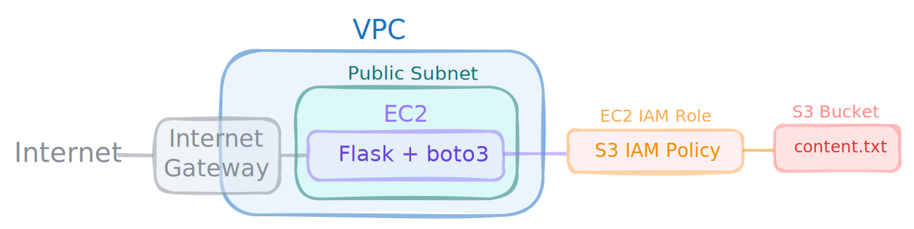
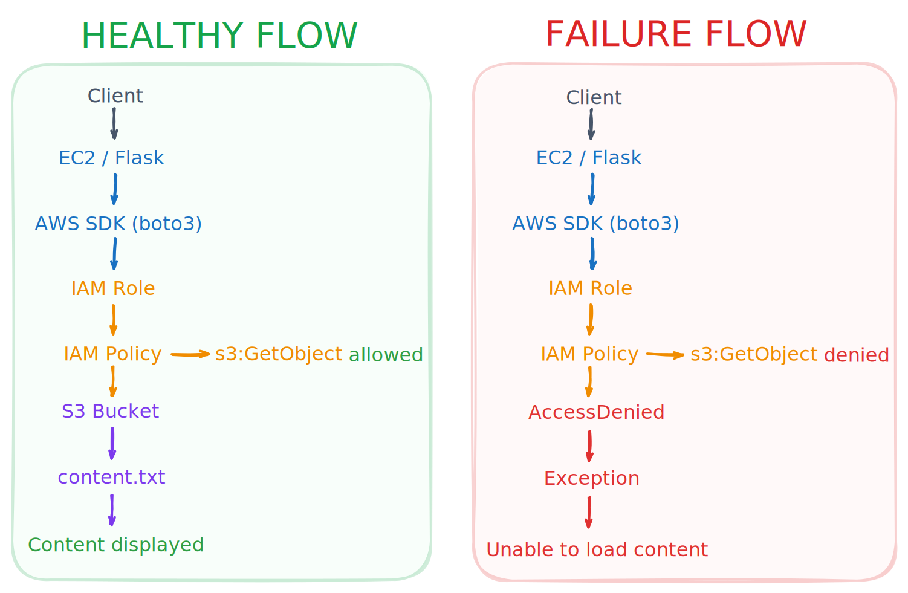

## Overview

This environment was created to simulate an AWS authorization failure scenario involving an EC2-hosted web application and an Amazon S3 bucket.

The lab consists of a public EC2 instance running a Flask application. The application retrieves content from S3 using the AWS SDK (boto3), and access depends on the IAM permissions attached to the instance role.

The environment is intentionally lightweight and focuses on authorization troubleshooting and incident investigation workflows.

## Components

|Component|Role|
|---|---|
|VPC|Provides network isolation for the environment|
|Public Subnet|Hosts the EC2 instance|
|Internet Gateway|Provides internet connectivity|
|Route Table|Routes traffic to the Internet Gateway|
|Security Group|Controls HTTP and SSH access|
|EC2 Instance|Hosts the Flask application|
|Flask Application|Retrieves content from S3|
|AWS SDK (boto3)|Performs S3 API requests|
|IAM Role|Provides credentials to the instance|
|IAM Policy|Grants S3 permissions|
|Amazon S3 Bucket|Stores application content|
|S3 Object|Content displayed by the application|

## Runtime Behavior

The application retrieves the target object from Amazon S3 on every HTTP request.

If the request succeeds, the object content is displayed to the user.

If the request fails, the application displays a generic error message.

Because the lookup occurs at request time, changes to IAM permissions become visible immediately after refreshing the page.

## Topology

## Request Flow

## Reproduction

See [reproduction.md](./reproduction.md)